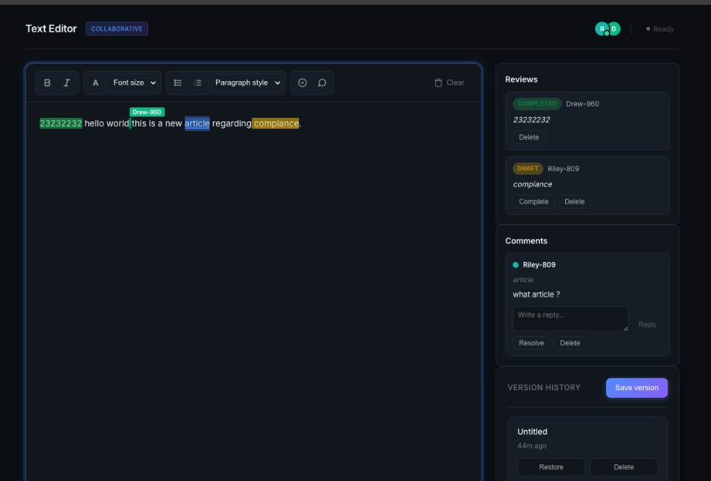
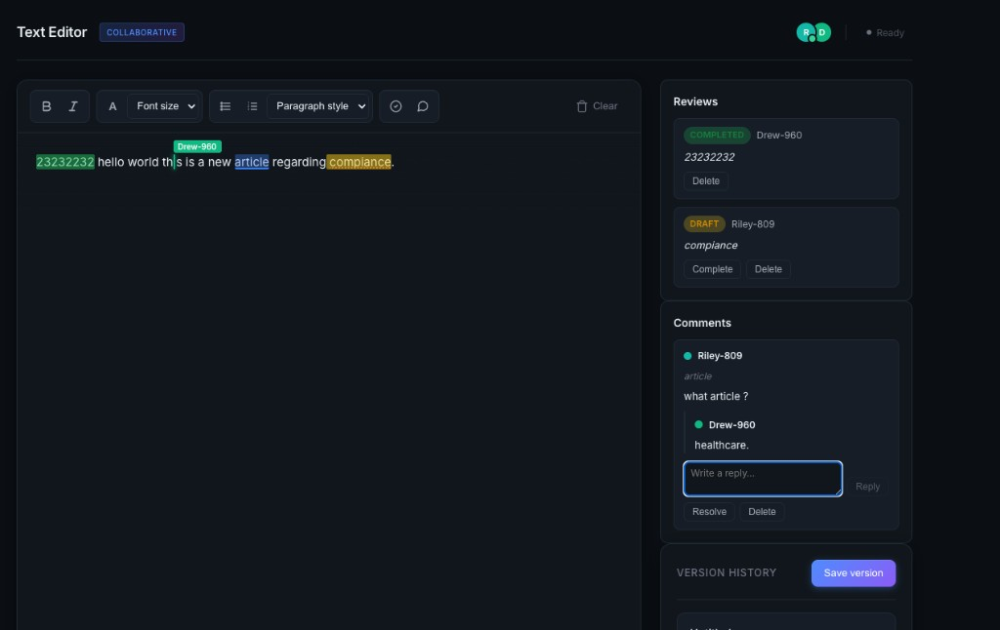

# Text Editor (React + TypeScript + Vite)

A small in-browser text editor with:
- Bold / Italic formatting
- Clear button (with confirmation)
- Live word count
- Autosave to `localStorage`
- Named version snapshots (save / restore / delete)

## Screenshots

**Screenshots:**

Collaborative editor — toolbar, remote caret, review highlights, reviews panel, comments, and version history:



Same session with an active comment thread (reply and “Write a reply…”):



## Requirements

- Node.js **18+** (recommended)
- pnpm (recommended)

## Run locally

If you don’t have pnpm yet, you can enable it via Corepack:

```bash
corepack enable
```

Install dependencies:

```bash
pnpm install
```

Start the dev server:

```bash
pnpm dev
```

Then open the URL shown in your terminal (usually `http://localhost:5173`).

## Build & preview (production)

Create a production build:

```bash
pnpm build
```

Preview the production build locally:

```bash
pnpm preview
```

## Tests

The test suite uses [Vitest](https://vitest.dev/) with [Testing Library](https://testing-library.com/react) and jsdom.

**Watch mode** (re-runs on file changes, default for local development):

```bash
pnpm test
```

**Single run** (exits with a non-zero code on failure; use in CI or before commits):

```bash
pnpm test:run
```

## How to use the app

- **Type in the editor**: click into the main editor area and start typing.
- **Bold / Italic**: select text, then click **B** (bold) or **I** (italic).
- **Clear**: click **Clear** to wipe the editor (you’ll be asked to confirm).
- **Word count**: shown under the editor and updates as you type.
- **Versions**:
  - Click **Save version**, enter a name (or leave blank for “Untitled”) to snapshot the current content.
  - Click **Restore** on a saved version to load it into the editor.
  - Click **Delete** to remove a saved version (with confirmation).

## Notes

- Editor content and versions are stored in your browser’s `localStorage` (per browser/profile).
